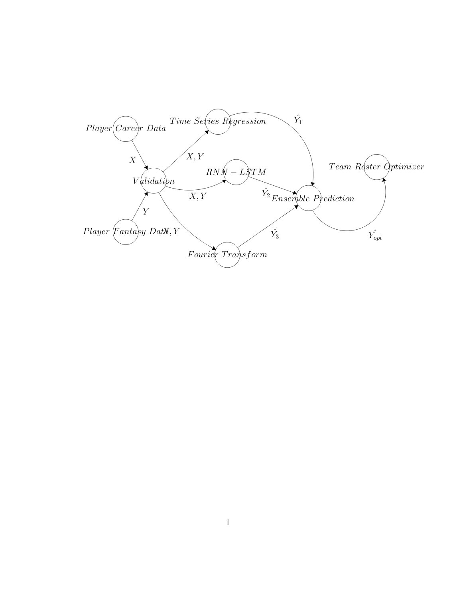

# Convex Optimization Final Project
## Authors: Tumas Rackaitis, Wes Patterson, Khang Nyugen, and Daniel Firebanks.
## Description: 
This repo includes:
-- An ETL pipeline to get data on every football player since 1970.

-- 3 Time Series models (LSTM-RNN, Time Series AutoRegressor, and Fourier Transform) to predict fantasy scores.

-- An optimizer to weigh those outputs and identify the best prediction. 

-- A portfolio optimization algorithm that Maximizes the Expected Value of Fantasy points (Return) and minimizes Variance of Fantasy Points (Risk). By applying portfolio optimization methodolgies in Finance, we're able to get a pretty good result.

## Results:
We got an A+ on this project, plus we won enough money in draftkings to buy some burritos.

## Infrastructure:

